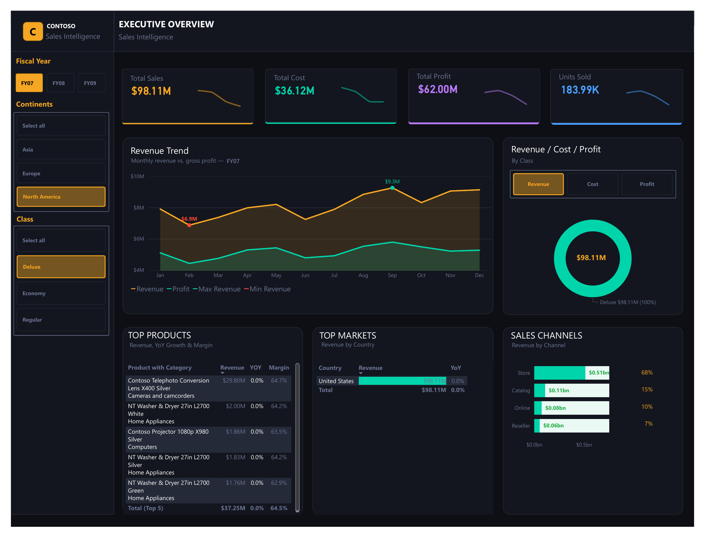

# Contoso Sales Intelligence

> A dark-themed, executive-grade Power BI dashboard built on the Microsoft Contoso Data Warehouse — covering $12.4B in multi-channel sales across FY07–FY09, with dynamic metric switching powered by **Field Parameters** and full time-intelligence for YOY analysis.



---

## Table of Contents

- [Overview](#overview)
- [Data Model](#data-model)
- [Field Parameters](#field-parameters)
- [DAX Measures](#dax-measures)
- [Dashboard Layout](#dashboard-layout)
- [Key Insights](#key-insights)
- [How to Use](#how-to-use)
- [Files](#files)
- [Tools Used](#tools-used)

---

## Overview

This single-page executive dashboard analyses Contoso's retail operations across three fiscal years (FY07–FY09), eight product categories, four sales channels, and markets spanning North America, Europe, and Asia. It combines a dual-fact-table model with a Field Parameter slicer to let stakeholders toggle the primary metric — Revenue, Cost, or Profit — without switching pages or modifying the report.

**Data scope at a glance:**

| Metric | Value |
|---|---|
| Total Revenue (all channels) | $12.41B |
| Total Online Revenue | $2.72B |
| Overall Gross Margin | ~50.5% |
| Fiscal Years | FY07 · FY08 · FY09 |
| Product Categories | 8 |
| Sales Channels | 4 (Store · Online · Reseller · Catalog) |
| Markets | 15+ countries across 3 continents |

---

## Data Model

A star schema with two fact tables feeding the same dimension layer.

```
DimProductCategory ──┐
                     │ (1:Many)
DimProductSubcategory┤
                     │ (1:Many)
DimProduct ──────────┴──────── FactOnlineSales ──── DimDate
                                   (CustomerKey,         │
                                    ProductKey,     (1:Many)
                                    StoreKey,             │
                                    DateKey,         DimStore ──── DimGeography
                                    SalesAmount,     DimStore ──── DimEmployee
                                    TotalCost,
                                    SalesQuantity)

DimChannel ────────────────── FactSales ─────────── DimDate
                               (channelKey,
                                ProductKey,
                                StoreKey,
                                DateKey,
                                SalesAmount,
                                TotalCost,
                                SalesQuantity)
```

### Tables

#### Fact Tables

| Table | Rows | Key Columns | Purpose |
|---|---|---|---|
| `FactOnlineSales` | Large | DateKey, ProductKey, StoreKey, CustomerKey, SalesAmount, TotalCost, SalesQuantity | Online channel transactions — source for Revenue, Cost, Margin, and YOY measures |
| `FactSales` | Large | DateKey, channelKey, ProductKey, StoreKey, SalesAmount, TotalCost, SalesQuantity | All-channel transactions — source for RevenueSales, channel mix, and market analysis |

#### Dimension Tables

| Table | Columns | Description |
|---|---|---|
| `DimDate` | 13 | Full fiscal + calendar date table with FY Label, MonthName, MonthNumber calculated columns |
| `DimProduct` | 9 | Product master — ProductKey, ProductName, ProductLabel, ClassID, ClassName, UnitCost, UnitPrice |
| `DimProductSubcategory` | 8 | Mid-level product grouping; bridges DimProduct → DimProductCategory |
| `DimProductCategory` | 7 | Top-level category: Home Appliances, Cameras, Computers, TV and Video, Cell Phones, Audio, etc. |
| `DimChannel` | 7 | Store, Online, Reseller, Catalog — used for channel-mix analysis |
| `DimGeography` | 3 | GeographyKey, ContinentName, RegionCountryName — drives the Top Markets table |
| `DimStore` | 6 | Store master — StoreKey, StoreName, StoreType, links to Geography and Employee |
| `DimEmployee` | 8 | Employee master — FirstName, LastName, Title, DepartmentName; used for store manager assignment |
| `Amounts` | 3 | **Field Parameter table** — see [Field Parameters](#field-parameters) section |

#### Relationships (18 total — active, single-direction)

| From | Column | To | Column |
|---|---|---|---|
| `FactOnlineSales` | DateKey | `DimDate` | Datekey |
| `FactOnlineSales` | ProductKey | `DimProduct` | ProductKey |
| `FactOnlineSales` | StoreKey | `DimStore` | StoreKey |
| `FactSales` | DateKey | `DimDate` | Datekey |
| `FactSales` | ProductKey | `DimProduct` | ProductKey |
| `FactSales` | StoreKey | `DimStore` | StoreKey |
| `FactSales` | channelKey | `DimChannel` | ChannelKey |
| `DimProduct` | ProductSubcategoryKey | `DimProductSubcategory` | ProductSubcategoryKey |
| `DimProductSubcategory` | ProductCategoryKey | `DimProductCategory` | ProductCategoryKey |
| `DimStore` | GeographyKey | `DimGeography` | GeographyKey |
| `DimStore` | StoreManager | `DimEmployee` | EmployeeKey |

---

## Field Parameters

The `Amounts` table is a **Power BI Field Parameter** — a feature that enables dynamic metric switching directly from a visual-level slicer without writing SWITCH measures or duplicating pages.

```
Amounts table (3 columns):
  ┌────────────┬─────────────────┬──────────────┐
  │ Amounts    │ Amounts Fields  │ Amounts Order│
  ├────────────┼─────────────────┼──────────────┤
  │ "Revenue"  │ [Revenue]       │ 1            │
  │ "Cost"     │ [Cost]          │ 2            │
  │ "Profit"   │ [ProfitAmount]  │ 3            │
  └────────────┴─────────────────┴──────────────┘
```

**How it works in the dashboard:** The "Revenue / Cost / Profit — By Class" section contains three button-style tiles. Selecting any tile filters the `Amounts` parameter, which in turn swaps the measure driving the donut chart and any visuals bound to `Amounts[Amounts Fields]`. The result is a single donut visual that dynamically displays Revenue, Cost, or Profit without any page navigation or bookmarks.

**Why it matters for portability:** Field Parameters ship as a native table inside the `.pbix` file — no custom visuals or external tools required. The parameter is created via Modeling → New Parameter → Fields in Power BI Desktop.

---

## DAX Measures

All 18 measures live in the `_Measures` table.

### Core Financials

| Measure | DAX | Format |
|---|---|---|
| `Revenue` | `SUM(FactOnlineSales[SalesAmount])` | $#,0.00 |
| `Cost` | `SUM(FactOnlineSales[TotalCost])` | $#,0.00 |
| `ProfitAmount` | `SUM(FactOnlineSales[SalesAmount]) - SUM(FactOnlineSales[TotalCost])` | $#,0.00 |
| `Margin` | `DIVIDE([ProfitAmount], [Revenue])` | 0.00% |
| `RevenueSales` | `SUM(FactSales[SalesAmount])` | $#,0.## |
| `TotalSales` | `CALCULATE([RevenueSales], ALLSELECTED())` | $#,0.## |

### Time Intelligence

| Measure | DAX | Format |
|---|---|---|
| `PY Revenue` | `CALCULATE([Revenue], SAMEPERIODLASTYEAR('DimDate'[DateKey]))` | $#,0.00 |
| `YOY %` | `DIVIDE([Revenue] - [PY Revenue], [PY Revenue], 0)` | 0.00% |
| `Revenue vs PY %` | `VAR PY = [PY Revenue]  VAR CY = [Revenue]  RETURN IF(NOT ISBLANK(PY), DIVIDE(CY - PY, PY))` | — |

### Dynamic Labels & Conditional Formatting

| Measure | DAX | Purpose |
|---|---|---|
| `Revenue vs PY Label` | `VAR Pct = [Revenue vs PY %]  VAR Arrow = IF(Pct >= 0, "↑ ", "↓ ")  RETURN Arrow & FORMAT(ABS(Pct), "0.0%")` | Displays e.g. `↑ 12.0%` or `↓ 8.3%` in card visuals |
| `Revenue vs PY Color` | `IF([Revenue vs PY %] >= 0, "#00C04B", "#FF4444")` | Drives conditional font color on the label card |

### Chart Annotation Markers

| Measure | DAX | Purpose |
|---|---|---|
| `Max Revenue Marker` | `VAR MaxRev = CALCULATE(MAXX(VALUES(DimDate[MonthName]), [Revenue]), ALLEXCEPT(DimDate, DimDate[FY Label]))  RETURN IF([Revenue] = MaxRev, [Revenue])` | Returns a value only at the peak month — plotted as a scatter overlay on the Revenue Trend line to annotate the max point |
| `Min Revenue Marker` | Same pattern with `MINX` | Annotates the lowest-revenue month in the current FY context |

### Percentage Share

| Measure | DAX | Purpose |
|---|---|---|
| `Revenue %` | `DIVIDE([Revenue], CALCULATE([Revenue], ALLSELECTED(DimPromotion[PromotionName])))` | Revenue share within a promotion filter context |
| `RevenueSales %` | `DIVIDE([RevenueSales], CALCULATE([RevenueSales], ALLSELECTED()))` | Channel / category share of total |

### Utility

| Measure | DAX |
|---|---|
| `SelectedFY` | `SELECTEDVALUE(DimDate[FY Label])` — used to display the active fiscal year in card titles |
| `_1` | Constant `1` — used as a placeholder for visual formatting |

---

## Dashboard Layout

Single dark-themed page designed to read like an executive briefing.

### Left Panel — Filters

Three stacked slicers with button-style formatting:
- **Fiscal Year** — FY07 / FY08 / FY09 toggle buttons (single-select)
- **Continents** — Select All · Asia · Europe · North America
- **Class** — Select All · Deluxe · Economy · Regular (drives product tier analysis)

### Top Strip — KPI Cards (4 cards)

| Card | Measure | Visual Feature |
|---|---|---|
| **Total Sales** | `RevenueSales` (all channels) | Inline sparkline showing monthly trend |
| **Total Cost** | `Cost` | Inline sparkline |
| **Total Profit** | `ProfitAmount` | Inline sparkline |
| **Units Sold** | Sum of SalesQuantity | Inline sparkline |

### Row 2 — Revenue Trend + Dynamic Donut

**Revenue Trend** (left, ~60% width)
- Line chart: Revenue (teal line) and Profit (purple/dark line) plotted by MonthName
- Two scatter overlays using `Max Revenue Marker` and `Min Revenue Marker` — produce annotated data-point callouts on the peak and trough months
- Legend: Revenue · Profit · Max Revenue · Min Revenue
- X-axis: Jan → Dec; Y-axis: revenue scale in $M

**Revenue / Cost / Profit — By Class** (right, ~40% width)
- Three button tiles: **Revenue** · Cost · Profit — bound to `Amounts` Field Parameter
- Donut chart: segments by product Class (Deluxe / Economy / Regular) driven by the selected Field Parameter measure
- Center label shows the total for the selected metric

### Row 3 — Product · Market · Channel

**Top Products** (left)
- Table visual: Product with Category · Revenue · YOY · Margin
- Conditional formatting on Margin (color scale)
- Rows ranked by Revenue descending; Total (Top 5) footer row

**Top Markets** (center)
- Table visual: Country · Revenue · YoY
- In-cell data bar on Revenue column
- Summarised from DimGeography via FactSales relationship

**Sales Channels** (right)
- Horizontal bar chart: Store · Catalog · Online · Reseller
- Data labels show both absolute revenue and percentage share
- Store dominates at ~68%; Online at ~10–22% depending on FY filter

---

## Key Insights

**FY07 was the peak year** — Online Revenue of $1.01B dropped 16% in FY08 to $850M, partially recovering to $858M in FY09. The Revenue Trend line chart makes this FY-over-FY decline immediately visible.

**Home Appliances and Cameras lead online revenue** — Together they account for $1.44B of the $2.72B total online revenue (53%), despite Computers matching Cameras in total dollar terms.

**Store channel dominates** — At 56% of all-channel RevenueSales ($6.94B of $12.41B total), physical stores remain the primary revenue engine. Online contributes 22%, Reseller 14%, and Catalog 9%.

**Gross Margin is healthy at ~50.5%** — The Cost measure confirms that roughly half of online revenue flows to gross profit, with the Deluxe tier commanding the highest per-unit price points.

**North America is the primary market** — United States alone accounts for $7.04B (57%) of total RevenueSales; China is the second-largest market at $1.66B (13%).

---

## How to Use

1. Clone or download this repo
2. Open `Contoso Sales Intelligence.pbix` in **Power BI Desktop**
3. The Contoso dataset is embedded — no external connection required
4. Use the **Fiscal Year** buttons on the left to switch between FY07, FY08, and FY09
5. Use the **Revenue / Cost / Profit** tabs in the donut section to dynamically swap the primary metric via the Field Parameter
6. Filter by **Continent** and **Class** to drill into regional or tier-level performance

---

## Files

| File | Description |
|---|---|
| `Contoso Sales Intelligence.pbix` | Power BI Desktop file — open to explore, filter, or extend |
| `contoso_sales_intelligence.png` | Dashboard screenshot |
| `README.md` | This file |

---

## Tools Used

- **Power BI Desktop** — report authoring, data modelling, DAX measures
- **DAX** — time intelligence (SAMEPERIODLASTYEAR), dynamic labels with arrows, conditional color measures, Max/Min marker annotations
- **Power Query (M)** — data transformation and star schema construction from Contoso DW tables
- **Field Parameters** — dynamic measure switching (Revenue / Cost / Profit) without SWITCH logic or bookmarks
- **Contoso Data Warehouse** — Microsoft's sample retail dataset (consumer electronics, multi-channel, global)
