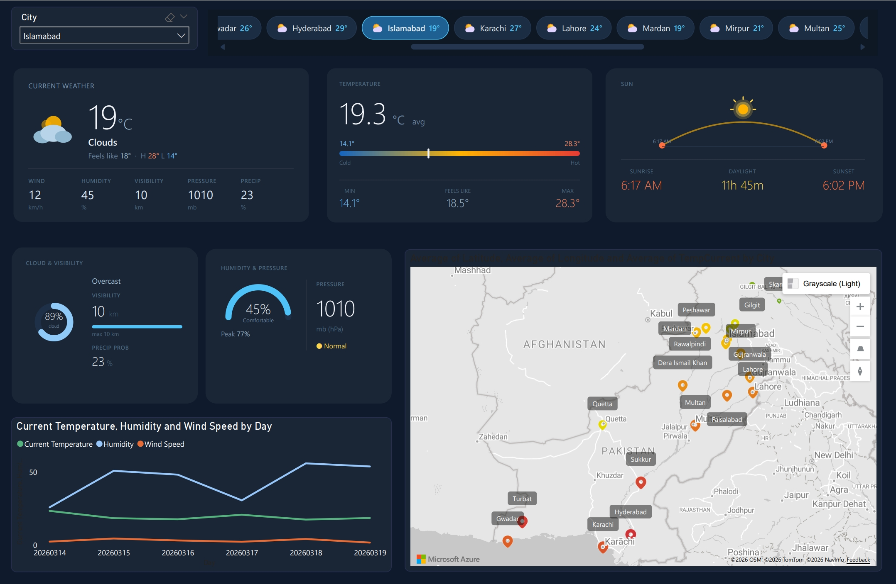

# Pakistan Weather Dashboard

> A live-connected, single-page Power BI dashboard delivering real-time 5-day weather forecasts across 20 major Pakistani cities — powered by the OpenWeatherMap API.



---

## Table of Contents

- [Overview](#overview)
- [Data Source & API Integration](#data-source--api-integration)
- [Data Model](#data-model)
- [DAX Measures](#dax-measures)
- [Dashboard Layout](#dashboard-layout)
- [Cities Covered](#cities-covered)
- [How to Use](#how-to-use)
- [Files](#files)
- [Tools Used](#tools-used)

---

## Overview

This dashboard fetches live forecast data from the OpenWeatherMap `/forecast` endpoint on every refresh, giving a city-by-city view of current conditions and the 5-day outlook across Pakistan. The entire data pipeline — API calls, transformation, and typing — is handled inside Power Query (M), with no intermediate files or databases required.

Selecting a city from the dropdown or the scrolling city strip instantly refreshes all cards, charts, and KPIs for that location.

---

## Data Source & API Integration

**API:** OpenWeatherMap Free Tier — `/data/2.5/forecast`  
**Endpoint pattern:** `https://api.openweathermap.org/data/2.5/forecast?q={city},{country}&units=metric&appid={key}`  
**Units:** Metric (°C, km/h, hPa, mm)  
**Refresh cadence:** On-demand (manual refresh in Power BI Desktop; schedulable via Power BI Service)

Each refresh hits the API once per city — 20 API calls total — and retrieves 40 rows per city (3-hour intervals × 40 = 5 days). The full dataset is **800 rows** per refresh.

The M query uses `Web.Contents` with `RelativePath` and `Query` record parameters to keep the base URL static (required for Power BI Service compatibility), iterates over a city list via `List.Transform`, and buffers all results with `List.Buffer` before transposing into a typed table.

---

## Data Model

A simple star schema with one fact table and two dimension tables.

```
dim_city ──────────────────┐
  CityKey (PK)             │  (1 : Many)
  City                     ├──── fact_weather_daily
  Province                 │        CityKey (FK)
  Region                   │        DateKey (FK)
  Latitude / Longitude     │        ... 22 weather columns
  WeatherIconUrl (DAX)     │
  Country (DAX)            │

dim_date ─────────────────────────────────────────
  DateKey (PK)
  Date, Year, Quarter, Month, Week, DayOfWeek, IsWeekend
  (Sep 14 2025 → Mar 19 2026)
```

### dim_city

| Column | Type | Description |
|---|---|---|
| `CityKey` | Integer | Primary key (1–20) |
| `City` | Text | City name |
| `Province` | Text | Province or territory |
| `Region` | Text | Sub-regional grouping |
| `Latitude` | Decimal | GPS latitude |
| `Longitude` | Decimal | GPS longitude |
| `WeatherIconUrl` | Text (DAX) | Dynamic SVG data URI — resolves to sun/cloud/rain/thunder/snow/mist icon based on dominant forecast condition |
| `Country` | Text (DAX) | Hard-coded "Pakistan" |

City data is embedded directly in the M query as a JSON string — no external file dependency.

### dim_date

| Column | Type | Description |
|---|---|---|
| `DateKey` | Integer | YYYYMMDD integer key |
| `Date` | Date | Calendar date |
| `Year` / `Quarter` / `MonthNumber` | Integer | Standard calendar fields |
| `MonthName` / `MonthShort` / `DayName` | Text | Human-readable labels |
| `WeekOfYear` | Integer | ISO week number |
| `DayOfWeek` | Integer | 1 = Monday, 7 = Sunday |
| `IsWeekend` | Boolean | True for Saturday & Sunday |

Generated entirely in Power Query — no external date table required.

### fact_weather_daily

| Column | Type | Description |
|---|---|---|
| `CityKey` | Integer | FK → dim_city |
| `DateKey` | Integer | FK → dim_date |
| `ObservationUnix` | Integer | Unix timestamp of the 3-hour slot |
| `ForecastDateTime` | Text | ISO datetime string (e.g. `2026-04-20 12:00:00`) |
| `TempCurrent` | Decimal | Temperature at slot (°C) |
| `TempFeelsLike` | Decimal | Apparent temperature (°C) |
| `TempMin` / `TempMax` | Decimal | Min/max within the 3-hour window (°C) |
| `Humidity` | Decimal | Relative humidity (%) |
| `Pressure` | Decimal | Atmospheric pressure (hPa) |
| `SeaLevelPressure` | Decimal | Pressure at sea level (hPa) |
| `GroundLevelPressure` | Decimal | Pressure at ground level (hPa) |
| `Visibility` | Decimal | Visibility (metres, max 10,000) |
| `WindSpeed` | Decimal | Wind speed (m/s converted to km/h in visuals) |
| `WindDirection` | Decimal | Wind direction (degrees) |
| `WindGust` | Decimal | Wind gust speed (m/s) |
| `CloudCover` | Decimal | Cloud cover (%) |
| `WeatherCondition` | Text | OWM main group (e.g. `Clouds`, `Rain`, `Clear`) |
| `WeatherDescription` | Text | OWM sub-description (e.g. `overcast clouds`) |
| `WeatherConditionId` | Integer | OWM condition code (e.g. 800 = clear sky) |
| `PrecipitationProbability` | Decimal | Probability of precipitation (0–1) |
| `Rain3h` | Decimal | Rainfall volume in the 3-hour window (mm) |
| `Snow3h` | Decimal | Snowfall volume in the 3-hour window (mm) |
| `PartOfDay` | Text | `d` (day) or `n` (night) per OWM sys.pod |

### Relationships

| From | To | Cardinality |
|---|---|---|
| `fact_weather_daily[CityKey]` | `dim_city[CityKey]` | Many → One |
| `fact_weather_daily[DateKey]` | `dim_date[DateKey]` | Many → One |

---

## DAX Measures

All measures live in `fact_weather_daily` under the `KPIs` display folder.

| Measure | Formula | Description |
|---|---|---|
| `AverageTemperature` | `AVERAGE(TempCurrent)` | Avg temperature across filtered rows |
| `FeelsLikeTemperature` | `AVERAGE(TempFeelsLike)` | Avg apparent temperature |
| `PeakForecastTemp` | `MAX(TempMax)` | Highest forecasted temperature |
| `LowForecastTemp` | `MIN(TempMin)` | Lowest forecasted temperature |
| `AverageHumidity` | `AVERAGE(Humidity)` | Avg relative humidity |
| `AverageWindKmh` | `AVERAGE(WindSpeed)` | Avg wind speed |
| `AveragePressureHpa` | `AVERAGE(Pressure)` | Avg atmospheric pressure |
| `ForecastIntervals` | `COUNTROWS(fact_weather_daily)` | Total 3-hour intervals in view |
| `CitiesInView` | `DISTINCTCOUNT(CityKey)` | Number of distinct cities in filter context |
| `AvgPrecipitationChance` | `AVERAGE(PrecipitationProbability)` | Avg precipitation probability |

The `WeatherIconUrl` calculated column on `dim_city` uses a DAX `IF` chain to resolve the dominant weather condition for each city into an inline SVG data URI — producing dynamic weather icons without any external image hosting.

---

## Dashboard Layout

The dashboard is a single dark-themed page, designed to read like a weather app rather than a traditional BI report.

### Top Bar — City Navigation
- **Dropdown slicer** (left): Select any of the 20 cities; all visuals respond instantly
- **Scrolling city strip** (right): Horizontal button row showing every city's current temperature and weather icon — acts as both a visual summary and an alternate slicer

### Row 1 — Current Conditions (3 cards)

| Card | Content |
|---|---|
| **Current Weather** | Large temperature reading, weather condition label, feels-like / high / low row, and five sub-metrics: Wind (km/h) · Humidity (%) · Visibility (km) · Pressure (hPa) · Precip Probability (%) |
| **Temperature** | Average temperature prominently displayed, Cold→Hot gradient bar with current position marked, and three sub-values: Min · Feels Like · Max |
| **Sun** | Sunrise/sunset arc animation, plus Sunrise time · Daylight duration · Sunset time |

### Row 2 — Detail Cards + Map

| Panel | Content |
|---|---|
| **Cloud & Visibility** | Donut chart (cloud cover %), condition label (e.g. Overcast), visibility reading + max, precipitation probability |
| **Humidity & Pressure** | Radial gauge (humidity %), comfort label, peak humidity, pressure reading + normal/high/low indicator |
| **Map** | Azure Maps visual plotting all 20 cities by Latitude/Longitude; bubble size and colour encode current temperature — allows pan/zoom and click-to-filter |

### Row 3 — Trend Chart
- **Line chart**: Current Temperature · Humidity · Wind Speed plotted by DateKey over the 5-day forecast window — shows how conditions evolve day by day for the selected city

---

## Cities Covered

20 cities spanning all four provinces, AJK, Gilgit-Baltistan, and the federal capital:

| # | City | Province / Territory | Region |
|---|---|---|---|
| 1 | Lahore | Punjab | East Punjab |
| 2 | Faisalabad | Punjab | Central Punjab |
| 3 | Rawalpindi | Punjab | North Punjab |
| 4 | Gujranwala | Punjab | North Punjab |
| 5 | Multan | Punjab | South Punjab |
| 6 | Karachi | Sindh | Lower Sindh |
| 7 | Hyderabad | Sindh | Lower Sindh |
| 8 | Sukkur | Sindh | Upper Sindh |
| 9 | Peshawar | Khyber Pakhtunkhwa | KPK Central |
| 10 | Abbottabad | Khyber Pakhtunkhwa | KPK Hazara |
| 11 | Mardan | Khyber Pakhtunkhwa | KPK Central |
| 12 | Dera Ismail Khan | Khyber Pakhtunkhwa | KPK South |
| 13 | Quetta | Balochistan | North Balochistan |
| 14 | Gwadar | Balochistan | Coastal Balochistan |
| 15 | Turbat | Balochistan | South Balochistan |
| 16 | Muzaffarabad | AJK | AJK |
| 17 | Mirpur | AJK | AJK |
| 18 | Gilgit | Gilgit-Baltistan | Gilgit-Baltistan |
| 19 | Skardu | Gilgit-Baltistan | Gilgit-Baltistan |
| 20 | Islamabad | ICT | ICT |

---

## How to Use

1. **Clone or download** this repo
2. Open `Weather Dashboard.pbix` in **Power BI Desktop**
3. Go to **Home → Transform Data → Data Source Settings** and update the OpenWeatherMap API key if the embedded key has expired
4. Click **Home → Refresh** — Power Query will call the API for all 20 cities and load ~800 rows
5. Use the **City dropdown** or the **city strip** at the top to explore each location

> **API Key Note:** The file ships with a key embedded in the M query (`fact_weather_daily` partition). The free OWM tier allows up to 1,000 calls/day — a full 20-city refresh uses 20 calls. Replace the key string in the Power Query Advanced Editor if needed.

---

## Files

| File | Description |
|---|---|
| `Weather Dashboard.pbix` | Power BI Desktop file — open to explore, refresh, or extend |
| `weather_dashboard.png` | Dashboard screenshot |
| `README.md` | This file |

---

## Tools Used

- **Power BI Desktop** — report design, data modelling, DAX measures
- **Power Query (M)** — REST API integration, data transformation, star schema construction
- **OpenWeatherMap API** — `/data/2.5/forecast` endpoint (free tier)
- **Azure Maps** — built-in Power BI map visual for geospatial city plot
- **DAX** — dynamic SVG icon generation, KPI measures
